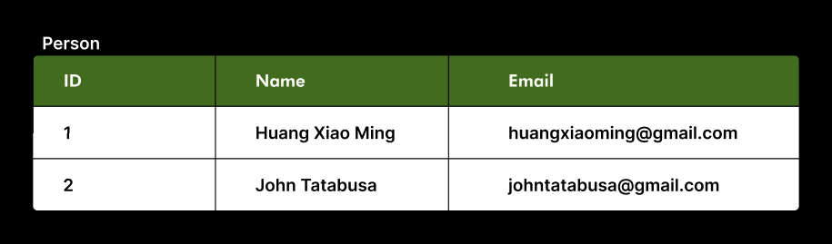

# Example 1

Relational databases store data as tables instead of objects. A `Person` table, for example, stores each person as a row. Each column of the row describes one thing about the person (for example, their name, their email). Very importantly, one row must represent one real-life object or relationship. It can be a person and contain their name and email. It can be a purchase and contain the customer ID and the total price. It can even be a parent-child relationship and contain the NRICs of the parent and the child. In the industry, tables are known for their data integrity and removal of redundancy. For those doing the application project, this might appeal to you: tables reduce tasks such as "List the emails of all employees in the logistics department" to a single-line query. Without tables, you would have to go to the dictionary of employees (which may be hidden away in Sh\*lve 🤮 or whatever), write a for loop and check if each employee's department is "logistics". (By the way, SQLite is a relational database, while Sh\*lve 🤮 is a key-value database.)

Flask-SQLAlchemy allows us to view tables as classes and objects. Each Python class is one table, each Python object is one row, and each class attribute is one column. It's a fairly elegant, intuitive mapping to whatever we've been taught so far about Python classes and objects.

In `app/models.py` you'll find:

```py
class Person(db.Model):
    id = db.Column(db.Integer, primary_key=True, autoincrement=True)
    name = db.Column(db.String(70))
    email = db.Column(db.String(320))
```

- `id` is a primary key, meaning it uniquely identifies the row. If you want to check if two things are the same row (or same person), you can look at their `id`s. `autoincrement=True` just sets the first row's `id` as `1`, the second row's `id` as `2`, and so on, so we don't have to do it ourselves. You can copy and paste this line in every table without thinking about it.
- `name` is a string field (max length 70 characters)
- `email` is a string field (max length 320 characters).

This essentially creates the columns of this table (data not included yet):



A lot of `main.py` is just Python logic, which we can skim over. But in the "write" if statement, focus on this (flattened to one line here):

```py
new_person = Person(name=inp_name, email=inp_email)
```

This creates a `new_person` object, with a class `Person`.

```py
db.session.add(new_person)
db.session.commit()
```

This sends `new_person` to the database for it to be stored. Note the two lines `db.session.add()` and `db.session.commit()` - in general, these need to be called together. It's a bit troublesome that we need to type two lines instead of one to save something, and engineers may justify this, saying it allows them to optimize and do error checking before they commit, but at this level we can just not worry and call them together.

Finally, in the "read" if statement:

```py
person_list = Person.query.all()
```

This gets the list of all Person objects in the table.

## Comparison

Note the similarities and differences between this and how we'd normally define `Person` classes and objects:

```py
# Defining the structure of our data

# Pure Python / Shelve
class Person:
    def __init__(self, name, email):
        self.name = name
        self.email = email

# Flask-SQLAlchemy
class Person(db.Model):
    id = db.Column(db.Integer, primary_key=True, autoincrement=True)
    name = db.Column(db.String(70))
    email = db.Column(db.String(320))
```

```py
# Creating a new object / row

# Pure Python / Shelve
new_person = Person(inp_name, inp_email)

# Flask-SQLAlchemy
new_person = Person(name=inp_name, email=inp_email)
```

```py
# Writing an object to a database

# Pure Python / Shelve
person_dict[id] = new_person
db = shelve.open('db')
db['Person'] = person_dict
db.close()

# Flask-SQLAlchemy
db.session.add(new_person)
db.session.commit()
```

```py
# Listing all objects from database

# Pure Python / Shelve
db = shelve.open('db')
person_list = list(db['Person'].values())
db.close()

# Flask-SQLAlchemy
person_list = Person.query.all()
```

So, true, we're still creating Python objects. We're just saving them into tables instead of Sh\*lve 🤮
